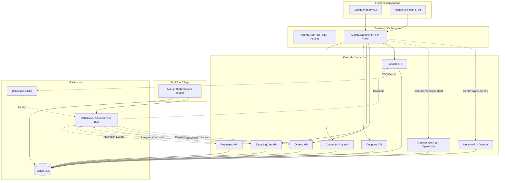

# Architecture Documentation

## Overview

**MangoAspire** is a cloud-native, microservices-based e-commerce platform built on **.NET 10** and orchestrated by **.NET Aspire**. It demonstrates a modern, scalable architecture using industry-standard patterns like CQRS, Event-Driven Architecture, and Vertical Slices.

## High-Level Architecture

The system is composed of several autonomous microservices, each with its own database, communicating primarily through the gateway and asynchronously via an Event Bus/Message Broker. A dedicated saga orchestrator service coordinates long-running workflows and persists saga state in its own database.

## Key Components

### 1. Identity & Security
- **Duende IdentityServer & OpenIddict**: Centralized authentication and authorization. `Identity.API` uses Duende; `OpenIdentity.App` uses OpenIddict.
- **Mutually exclusive providers**: `Mango.AppHost` starts exactly one, selected by the `IdentityType` setting (`Duende` — the default — or `OpenIddict`). An unrecognised value fails fast at startup. Every consumer resolves the authority from the selected provider's endpoint via `ServiceUrls__IdentityApp`, so no service hardcodes an identity URL.
- **OpenID Connect (OIDC)**: Used for secure communication between the frontends and microservices.
- **Token-Based Auth**: Bearer tokens handling access control. Authorization policies split the `scope` claim on whitespace so they hold under either provider's claim format.
- **Shared seed accounts**: `Mango.Core.Options.SeedUsersOptions` is bound by both providers with fixed IDs, keeping the OIDC `sub` claim stable across a provider switch.

See [Architecture Overview](architecture/overview.md#identity-provider-switch) for the full switch behaviour.

### 2. Event-Driven Communication
- **RabbitMQ**: Default message broker for local development.
- **Azure Service Bus**: Production-ready alternative (configurable via `AppHost`).
- **Integration Events**: Used for cross-service communication (e.g., `OrderCreated`, `PaymentSucceeded`).

### 3. Data Synchronization (CDC)
- **Debezium**: Captures row-level changes in the `Products` database via the `pgoutput` plugin (PostgreSQL runs with `wal_level=logical`).
- **Real-Time Sync**: Updates the `ShoppingCart` service's read model to ensure product prices and names are always current without direct service-to-service calls.
- **Eventual consistency is explicit**: `UpsertCart` verifies the product exists in the local replica and throws `DataVerificationException` if it has not been replicated yet, rather than failing on a foreign key violation.

### 4. Caching
- **`ICacheManager`**: A single caching abstraction (`Mango.Core.Caching`) implemented over .NET `HybridCache`, registered with `services.AddCacheManager()`.
- **L1 today, L2 when needed**: In-process by default; registering an `IDistributedCache` such as Redis adds a shared tier with no change to calling code.
- **Stampede protection**: Concurrent misses on the same key collapse into one factory call.
- **Current users**: `Products.API` catalog types (1 hour) and the `UserProfileCache` in both identity providers (5 minutes, tag-evictable).

### 5. Database Strategy
- **Database-per-Service**: Each microservice owns its data and schema.
- **PostgreSQL**: The primary relational database engine.
- **Entity Framework Core**: ORM for data access, using Code-First migrations.

### 6. AI Integration
- **ChatAgent.App**: A dedicated service for AI-powered interactions, utilizing **Semantic Kernel** to provide intelligent responses to user queries and conversation history persistence.
- **Local read-model, not cross-service calls**: products and categories are replicated into `chatagentdb` over Debezium CDC, so a chat turn never blocks on Products.API. Carts and coupons remain live HTTP calls because they are transactional writes.
- **Retrieval**: products, categories and markdown store documents share one pgvector index. Search is semantic when embeddings are configured and Postgres full-text search when they are not — `chatagentdb` therefore runs on the `pgvector/pgvector` image.
- **Guardrails**: a cheap relevance check runs before the agent (blocking off-topic questions and prompt injection before any tool executes), and every drafted answer is verified against the captured tool results before the customer sees it.
- See [ChatAgent Retrieval and Guardrails](CHAT_AGENT_RAG.md).

### 7. Observability
- **OpenTelemetry**: Built-in logging, metrics, and distributed tracing, configured once in `Mango.ServiceDefaults`.
- **Two backends in parallel**: every service exports to the **Aspire Dashboard** (all three signals) and to an **OpenTelemetry Collector** (logs and metrics), which fans out to **Loki** and **Prometheus** behind **Grafana** on port 3000.
- **Why both**: the Aspire dashboard is in-memory and resets with the AppHost; the Grafana stack persists history and is queryable with LogQL/PromQL.
- **Switchable**: `UseGrafanaStack=false` starts no observability containers. See [Observability](OBSERVABILITY.md).

## Service Breakdown

| Service | Responsibility | Database |
| :--- | :--- | :--- |
| **Identity.API** | AuthN/AuthZ, user management (Duende) — active when `IdentityType=Duende` | `identitydb` |
| **OpenIdentity.App** | AuthN/AuthZ using OpenIddict — active when `IdentityType=OpenIddict` | `openidentitydb` |
| **Products.API** | Product catalog management | `productdb` |
| **ShoppingCart.API** | User cart & items | `shoppingcartdb` |
| **Coupons.API** | Discount codes & promotions | `coupondb` |
| **Orders.API** | Order lifecycle management | `orderdb` |
| **Payments.API** | Payment processing simulation | `N/A` (Stateless) |
| **ChatAgent.App** | AI assistant for user queries; CDC read-model + pgvector retrieval | `chatagentdb` |
| **Mango.Orchestrators** | Complex transaction management (Sagas) | `sagaorchestratorsdb` |

> The two identity rows are alternatives, not peers — exactly one runs per launch.

## Project Structure (Vertical Slice)

Services follow the **Vertical Slice Architecture**, grouping code by feature (e.g., `CreateOrder`, `GetProduct`) rather than technical layers. This ensures high cohesion and low coupling.

## Containerization

- **Alpine Linux**: All microservices use **Alpine-based** Docker images (`aspnet:10.0-alpine`) to minimize footprint and reduce vulnerability surface area.
- **Multi-Stage Builds**: Dockerfiles are optimized using multi-stage builds to separate build-time dependencies from the runtime environment.
