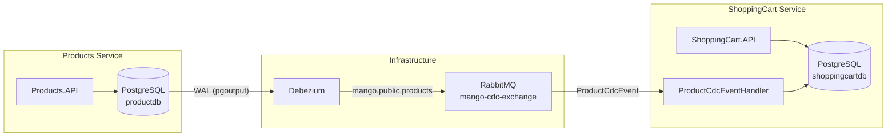

# Change Data Capture (CDC) with Debezium

## Overview

The MangoAspire project uses **Change Data Capture (CDC)** to synchronize data between microservices in real-time. This pattern ensures loose coupling and data consistency without direct synchronous calls or dual-write problems.

We use **[Debezium](https://debezium.io/)**, an open-source distributed platform for change data capture, to monitor database tables and stream changes to **RabbitMQ**.

## Architecture



### Components

1.  **Debezium Server**: Runs as a container, connecting to the PostgreSQL source database via logical replication (pgoutput).
2.  **RabbitMQ Exchange**: Events are published to `mango-cdc-exchange` (Topic exchange).
3.  **Consumers**: Services bind to this exchange to receive updates using `IIntegrationEventHandler`.

## Configuration

### 1. AppHost Setup
The Debezium container is configured in `Mango.AppHost`. It requires:
- **Environment Variables**: For DB and RabbitMQ credentials.
- **Init Script**: `init-scripts/init-debezium.sql` to set up replication roles and publication.

### 2. Database Setup
PostgreSQL source tables must be configured for logical replication. The `init-debezium.sql` script handles this automatically:

```sql
-- Creates replication user
CREATE ROLE debezium_user WITH REPLICATION LOGIN;
-- Grants permissions
GRANT SELECT ON ALL TABLES IN SCHEMA public TO debezium_user;
-- Creates publication
CREATE PUBLICATION debezium_publication FOR ALL TABLES;
```

### 3. Consumption (ShoppingCart.API)

To consume CDC events, services implement an `IIntegrationEventHandler`.

**Event Definition (`ProductCdcEvent.cs`):**
Use `[EventName]` to match Debezium's topic naming convention (`prefix.schema.table`):
```csharp
[EventName("mango.public.products")]
public record ProductCdcEvent : IntegrationEvent
{
    // Properties match JSON payload from Debezium
    public Guid Id { get; set; }
    // ...
}
```

**Handler Registration (`Program.cs`):**
```csharp
builder.AddRabbitMQEventBus("eventbus")
    .AddSubscription<ProductCdcEvent, ProductCdcEventHandler>("mango-cdc-exchange");
```

## Data Transformation

Debezium sends data in specific formats that require custom JSON converters:

- **Numeric Values**: Sent as `{"scale": 2, "value": "base64..."}`. Handled by `DebeziumNumericConverter`.
- **Deleted Flag**: Sent as string `"true"`/`"false"`. Handled by `StringToBoolConverter`.
- **Date/Time**: Sent as microseconds since epoch (requires converter if used).

## Adding New CDC Streams

To capture changes from another table:

1.  **Ensure Table is in Publication**: The default publication covers `ALL TABLES`, so new tables in `public` schema are auto-included.
2.  **Create Event DTO**: Create a class inheriting `IntegrationEvent` with `[EventName("mango.public.tablename")]`.
3.  **Create Handler**: Implement `IIntegrationEventHandler<T>`.
4.  **Register Subscription**: Add `.AddSubscription<T, H>("mango-cdc-exchange")` in `Program.cs`.

## Troubleshooting

-   **"Replication slot already exists"**: Debezium tries to reuse the slot. If it gets stuck, you may need to drop the slot in PostgreSQL: `SELECT pg_drop_replication_slot('mango_debezium_slot');`
-   **"Permission denied for table"**: Ensure `debezium_user` has `SELECT` privileges on the table.
-   **Serialization Errors**: Check `DebeziumNumericConverter` and ensure property names match JSON case (Debezium uses lowercase).
