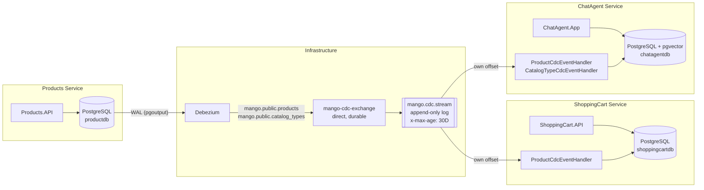

# Change Data Capture (CDC) with Debezium

## Overview

The MangoAspire project uses **Change Data Capture (CDC)** to synchronize data between microservices in real-time. This pattern ensures loose coupling and data consistency without direct synchronous calls or dual-write problems.

We use **[Debezium](https://debezium.io/)**, an open-source distributed platform for change data capture, to monitor database tables and stream changes to **RabbitMQ**.

Change records land in **`mango.cdc.stream`**, a RabbitMQ **stream** — an append-only, retained, totally ordered log. That choice is what makes the pipeline replayable: a stream is read non-destructively, so every service reads the whole log independently from its own stored offset, and a service with no offset starts at the beginning and rebuilds its read-model from history. Introducing a new consumer months later is a non-event.

## Architecture


```mermaid
flowchart LR
    subgraph Products Service
        P_DB[(PostgreSQL<br/>productdb)]
        P_API[Products.API]
        P_API --> P_DB
    end

    subgraph Infrastructure
        Deb[Debezium]
        EX[mango-cdc-exchange<br/>direct, durable]
        LOG[["mango.cdc.stream<br/>append-only log<br/>x-max-age: 30D"]]
        EX --> LOG
    end

    subgraph ShoppingCart Service
        SC_API[ShoppingCart.API]
        SC_DB[(PostgreSQL<br/>shoppingcartdb)]
        SC_Handler[ProductCdcEventHandler]

        SC_API --> SC_DB
        SC_Handler --> SC_DB
    end

    subgraph ChatAgent Service
        CA_App[ChatAgent.App]
        CA_DB[(PostgreSQL + pgvector<br/>chatagentdb)]
        CA_Handler[ProductCdcEventHandler<br/>CatalogTypeCdcEventHandler]

        CA_App --> CA_DB
        CA_Handler --> CA_DB
    end

    P_DB -->|"WAL (pgoutput)"| Deb
    Deb -->|"mango.public.products<br/>mango.public.catalog_types"| EX
    LOG -->|"own offset"| SC_Handler
    LOG -->|"own offset"| CA_Handler
```

### Components

1.  **Debezium Server**: Runs as a container, connecting to the PostgreSQL source database via logical replication (pgoutput).
2.  **RabbitMQ exchange**: Change records are published to `mango-cdc-exchange`, a **direct** exchange, with the Debezium topic name as the routing key.
3.  **The stream log**: `mango.cdc.stream` is bound to that exchange and retains everything it receives. Declared from `definitions.json` when the broker boots — see [Why the topology is declared at broker boot](#why-the-topology-is-declared-at-broker-boot).
4.  **Consumers**: Services register `AddStreamSubscription<TEvent, THandler>("mango.cdc.stream")` and implement `IIntegrationEventHandler<T>`. Each keeps its own position in `cdc_stream_offsets`, so several services mirror the same table independently and at their own pace.

### Captured tables

| Table | Routing key | Consumed by |
| --- | --- | --- |
| `public.products` | `mango.public.products` | ShoppingCart.API, ChatAgent.App |
| `public.catalog_types` | `mango.public.catalog_types` | ChatAgent.App |
| `public.debezium_signal` | — | Debezium itself (see [Deep backfill](#deep-backfill-incremental-snapshots)) |

`available_stock` **is** captured. It was previously excluded via `debezium.source.column.exclude.list` to keep saga-driven stock churn from fanning out to every subscriber, but that also left the chat agent unable to answer "do you have any left?" with anything other than a refusal.

The churn is real, and it is handled on the consumer side rather than by dropping the column:

- **The column is mapped as `int?`, and null means "not known" — not zero.** Records published before the column joined the capture list carry no such field, and on a replay those are the first thing a rebuild sees. With a non-nullable `int`, `System.Text.Json` would leave the member at its default and silently report the entire menu as out of stock.
- **Stock is deliberately not part of the indexed text.** `ProductCdcEventHandler.BuildSearchableText` covers name, category and description only. `VectorIndexer` nulls a document's embedding whenever its content changes, so including a value the checkout saga rewrites on every purchase would cost an embedding call per order and briefly drop the dish out of semantic search. `HandleAsync_When_OnlyStockChanges_Then_KeepsTheExistingEmbedding` pins this.

After enabling the column, existing mirror rows still hold null until they are re-emitted — see [Deep backfill](#deep-backfill-incremental-snapshots), then confirm with:

```sql
-- in chatagentdb
SELECT count(*) FROM products WHERE available_stock IS NULL;   -- expect 0
```

Note that `available_stock` was `0` for every seeded product in `productdb` (nothing in the seed path ever set it), so `Products.API`'s `SeedProductStock` migration corrects that first. Replicating before that fix would have the agent truthfully report the whole menu as unavailable.

## Ordering and the replay fence

Because the log is replayable, handlers **re-see records they have already applied** — that is the normal case during a rebuild, not an edge case. Applying an old record over newer state would silently corrupt the read-model, so ordering is enforced explicitly.

`ExtractNewRecordState` is configured with `add.fields`, which injects source metadata into the payload:

```properties
debezium.source.transforms.unwrap.add.fields=op,source.lsn,source.ts_ms,source.txId
```

These arrive as `__op`, `__source_lsn`, `__source_ts_ms` and `__source_txId`, and deserialize onto `CdcIntegrationEvent`. They are put in the payload rather than only the AMQP headers so ordering survives deserialization and can be unit tested.

Every mirror row carries the `source_lsn` and `source_timestamp` of the record it reflects. Before mutating anything, handlers call `CdcIntegrationEvent.IsStaleAgainst(rowLsn, rowTimestamp)` and skip the record if it is not strictly newer:

- **LSN is authoritative.** The Postgres WAL position is monotonic per cluster, including across replication-slot recreation. Equality counts as stale, so an exact redelivery is free — no rewrite, and no needless embedding invalidation in ChatAgent.
- **`ts_ms` is the fallback**, used only when either side lacks an LSN. Equality here does *not* count as stale: millisecond resolution means many rows share a commit timestamp, and treating those as stale would drop real changes.
- **Neither present → apply.** Records published before `add.fields` was configured keep working.

`UpdatedAt` on the mirror is the local processing time and must never be used to order events.

> **Caveat.** LSN monotonicity does not survive restoring PostgreSQL from a backup, since the WAL position can move backwards. `ts_ms` is the fallback in that situation.

### Deletes are tombstoned, not removed

An upstream delete sets `is_deleted` rather than removing the row, because deleting it would delete its LSN watermark too — and a replayed older insert would then resurrect the product. ChatAgent's mirrors carry a global query filter (`HasQueryFilter(x => !x.IsDeleted)`), so every read path excludes them automatically; CDC handlers opt out with `IgnoreQueryFilters()` so a genuine upstream re-insert (which arrives with a higher LSN) can clear the tombstone.

ShoppingCart deliberately has **no** global filter: `CartDetails.Product` is a required navigation and filtering it would break the cart projection in `GetCartHandler`. A cart keeps rendering a delisted product it already contains; `UpsertCart` is what refuses to add one.

## Configuration

### 1. AppHost setup

The Debezium container is configured in `Mango.AppHost`. It requires:
- **Environment variables**: for DB and RabbitMQ credentials.
- **Init script**: `init-scripts/productdb/init-debezium.sql` to set up replication roles and publication.
- **Connector config**: `init-configs/products/application.properties`.

RabbitMQ uses a data volume so the retained log survives container recreation. The CDC topology itself is imported by a separate one-shot `cdc-topology` container (see below).

### 2. Database setup

PostgreSQL source tables must be configured for logical replication. The `init-debezium.sql` script handles this automatically:

```sql
-- Creates replication user
CREATE ROLE debezium_user WITH REPLICATION LOGIN;
-- Grants permissions
GRANT SELECT ON ALL TABLES IN SCHEMA public TO debezium_user;
-- Creates publication
CREATE PUBLICATION debezium_publication FOR ALL TABLES;
```

### 3. Consumption

**Event definition** — inherit `CdcIntegrationEvent` so the record carries the ordering metadata and the delete marker, and use `[EventName]` to match Debezium's topic naming (`prefix.schema.table`):

```csharp
[EventName("mango.public.products")]
public record ProductCdcEvent : CdcIntegrationEvent
{
    // Properties match the JSON payload from Debezium — physical column names.
    [JsonPropertyName("id")]
    public Guid ProductId { get; set; }
    // ...
}
```

**Handler registration (`Program.cs`)** — `AddStreamSubscription`, not `AddSubscription`:

```csharp
builder.AddRabbitMQEventBus("eventbus")
    .AddStreamSubscription<ProductCdcEvent, ProductCdcEventHandler>("mango.cdc.stream");
```

The service also needs an `ICdcOffsetStore` registration to persist its position:

```csharp
services.AddScoped<ICdcOffsetStore, CdcOffsetStore>();
```

Tuning lives under `EventBus:Stream` (`PrefetchCount`, `CheckpointEveryMessages`, `CheckpointInterval`, `HandlerRetryCount`); the defaults are sensible and no service currently overrides them.

## Replay

Each service records the last offset it processed in its own `cdc_stream_offsets` table. **Deleting that row is the replay button.**

```sql
-- in chatagentdb or shoppingcartdb
DELETE FROM cdc_stream_offsets;
```

Restart the service. With no stored offset the consumer attaches at `first` and re-reads the whole retained log; the LSN fence makes re-applying already-current records a no-op, so a replay against an up-to-date mirror leaves it byte-identical. Dropping the service's database entirely has the same effect on first boot — the mirror and (for ChatAgent) its `vector_documents` index rebuild from the log.

Offsets are checkpointed *outside* the handler's transaction, so a crash between the two replays the last few records. That is at-least-once by design, and safe precisely because of the fence.

### Onboarding a brand-new consumer

1. Define the event records (inheriting `CdcIntegrationEvent`) and handlers.
2. Register `AddStreamSubscription<T, H>("mango.cdc.stream")` and an `ICdcOffsetStore`.
3. Start the service. With no stored offset it replays everything the log retains.
4. Only if the required history predates the retention window, run an incremental snapshot (below).

Nothing about Debezium, the exchange, or the other consumers changes.

## Deep backfill: incremental snapshots

Stream retention is finite (`x-max-age: 30D`). When a consumer needs history older than that — or a table was added to the capture list after the initial snapshot already ran — ask Debezium to re-read the source:

```http
POST /api/products/cdc-snapshots
Content-Type: application/json

{ "tables": ["public.products"] }
```

This inserts a row into `public.debezium_signal`, which the connector watches (`signal.enabled.channels=source`, `signal.data.collection=public.debezium_signal`). Debezium then re-emits every row of the named tables into the stream, interleaved with live changes and de-duplicated against its snapshot window.

Crucially it does this **without dropping the replication slot or the offsets file**, so consumers that are already up to date are unaffected — their fence discards the re-read rows as stale. This replaces the old "delete the volume and re-snapshot everything" procedure.

> The endpoint is currently **unauthenticated**, matching every other endpoint in Products.API (which has no authentication configured at all, not even on `DELETE /api/products/{id}`). It is an administrative operation and should be locked down when auth is added to that service.

## Data transformation

Debezium sends data in specific formats that require custom JSON converters:

- **Numeric values**: sent as `{"scale": 2, "value": "base64..."}` — a base64 big-endian two's-complement integer plus a scale. Handled by `DebeziumNumericConverter`.
- **Deleted flag**: `delete.handling.mode=rewrite` marks deletes with a `__deleted` field carrying the string `"true"`/`"false"`, rather than emitting a tombstone. Exposed as `CdcIntegrationEvent.IsDeleted`.
- **Date/time**: sent as microseconds since epoch (requires a converter if used).

## Adding a new captured table

1.  **Ensure the table is in the publication**: the default publication covers `ALL TABLES`, so new tables in the `public` schema are auto-included.
2.  **Add the table to the include list**: `debezium.source.table.include.list` in `init-configs/products/application.properties` is an explicit allow-list — a table absent from it is never captured, publication or not.
3.  **Bind the routing key to the stream**: add a binding for `mango.public.<table>` in `init-configs/rabbitmq/definitions.json`. Without it the direct exchange drops those records.
4.  **Create the event record**: inherit `CdcIntegrationEvent` with `[EventName("mango.public.<table>")]`.
5.  **Create the handler**: implement `IIntegrationEventHandler<T>`, fencing on `IsStaleAgainst` and tombstoning deletes.
6.  **Register the subscription**: `.AddStreamSubscription<T, H>("mango.cdc.stream")` in `Program.cs`.
7.  **Backfill the existing rows**: `POST /api/products/cdc-snapshots` with the new table. `snapshot.mode=initial` means Debezium only snapshots on its first run, so a table added later captures future changes but not existing rows.

## Why the topology is declared at broker boot

`mango-cdc-exchange` is a **direct** exchange, and RabbitMQ **silently discards messages that match no binding** — no error, no dead letter, nothing in the logs. Debezium takes its initial snapshot the moment it starts.

The topology is therefore imported by a one-shot `cdc-topology` container, which POSTs `init-configs/rabbitmq/definitions.json` to the RabbitMQ **management API** once the broker is up. Debezium then `WaitForCompletion`s on it. So `mango.cdc.stream` and its bindings exist before Debezium publishes anything and regardless of which services are running — the dependency is on infrastructure, not on any consumer. The exchange is declared **durable**, so it also survives a broker restart.

> **Why the HTTP API and not the broker's own `load_definitions` setting.** A node configured to import definitions at boot logs
>
> ```
> Will not seed default virtual host and user: have definitions to load...
> ```
>
> and **skips creating the default user entirely**. `RABBITMQ_DEFAULT_USER`/`RABBITMQ_DEFAULT_PASS` are then ignored, and every service is rejected with `PLAIN login refused: user 'guest' - invalid credentials`. Definitions become the sole source of truth for users, so the file would have to carry them — impossible here, since the password is a generated secret parameter and RabbitMQ stores only a salted hash. Importing over the API after boot avoids the interaction completely.

> **Do not re-declare `mango-cdc-exchange` from application code.** The definitions declare it durable; a mismatched declare raises `406 PRECONDITION_FAILED` and kills the channel.

This replaced an earlier ordering hack, where `AppHost.cs` declared the Debezium container *after* its consumers with `.WaitFor(...)` on each. That worked for services present at startup but could never help a service introduced later — which is precisely the problem the stream solves.

Symptom when the topology is missing: the source table has rows, Debezium's log says `Sending N records to topic mango.public.<table>`, and yet the stream shows `messages = 0`. Confirm with:

```powershell
docker exec <rabbitmq> rabbitmqctl list_bindings source_name destination_name routing_key
docker exec <rabbitmq> rabbitmqctl list_queues name type durable messages
```

`mango.cdc.stream` should report type `stream`.

## Failure handling

A stream has **no redelivery** — acking only advances the reader's position. A handler failure is therefore retried in process (`HandlerRetryCount`, exponential backoff) rather than nacked. If every attempt fails the record is copied to the service's `.dlx` dead-letter exchange, the reader advances, and an error is logged saying the read-model is now missing that change. Fix the cause, then replay.

## Troubleshooting

-   **"Replication slot already exists"**: Debezium tries to reuse the slot. If it gets stuck, drop it in PostgreSQL: `SELECT pg_drop_replication_slot('mango_debezium_slot');`
-   **"Permission denied for table"**: ensure the connector's user has `SELECT` privileges on the table.
-   **Serialization errors**: check `DebeziumNumericConverter` and ensure property names match the JSON case (Debezium emits physical column names, lowercase).
-   **Consumer stuck at an old offset**: check `cdc_stream_offsets` in the service's database, and its logs for repeated dead-lettering.
-   **`PRECONDITION_FAILED` on `basic.consume`**: a stream requires a non-zero prefetch. `StreamConsumerOptions.PrefetchCount` must not be 0.
