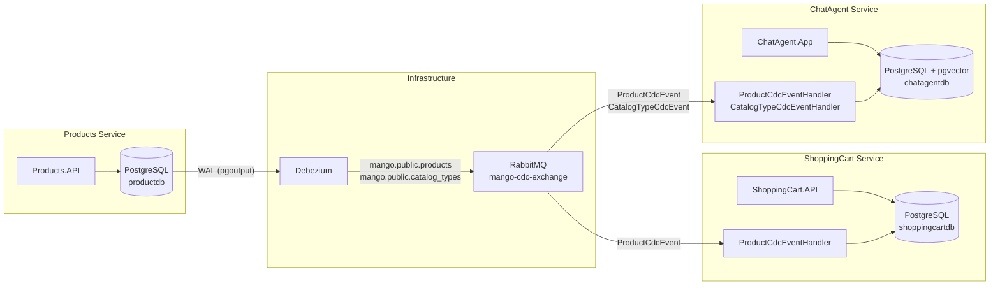

# Change Data Capture (CDC) with Debezium

## Overview

The MangoAspire project uses **Change Data Capture (CDC)** to synchronize data between microservices in real-time. This pattern ensures loose coupling and data consistency without direct synchronous calls or dual-write problems.

We use **[Debezium](https://debezium.io/)**, an open-source distributed platform for change data capture, to monitor database tables and stream changes to **RabbitMQ**.

## Architecture


```mermaid
flowchart LR
    subgraph Products Service
        P_DB[(PostgreSQL<br/>productdb)]
        P_API[Products.API]
        P_API --> P_DB
    end

    subgraph Infrastructure
        Deb[Debezium]
        RMQ[RabbitMQ<br/>mango-cdc-exchange]
    end

    subgraph ShoppingCart Service
        SC_API[ShoppingCart.API]
        SC_DB[(PostgreSQL<br/>shoppingcartdb)]
        SC_Handler[ProductCdcEventHandler]
        
        SC_API --> SC_DB
        SC_Handler --> SC_DB
    end

    subgraph ChatAgent Service
        CA_App[ChatAgent.App]
        CA_DB[(PostgreSQL + pgvector<br/>chatagentdb)]
        CA_Handler[ProductCdcEventHandler<br/>CatalogTypeCdcEventHandler]

        CA_App --> CA_DB
        CA_Handler --> CA_DB
    end

    P_DB -->|"WAL (pgoutput)"| Deb
    Deb -->|"mango.public.products<br/>mango.public.catalog_types"| RMQ
    RMQ -->|"ProductCdcEvent"| SC_Handler
    RMQ -->|"ProductCdcEvent<br/>CatalogTypeCdcEvent"| CA_Handler
```

### Components

1.  **Debezium Server**: Runs as a container, connecting to the PostgreSQL source database via logical replication (pgoutput).
2.  **RabbitMQ Exchange**: Events are published to `mango-cdc-exchange` (Topic exchange).
3.  **Consumers**: Services bind to this exchange to receive updates using `IIntegrationEventHandler`. Each consumer declares its own queue (`carts.queue`, `chatagent.queue`), so several services can mirror the same table independently — a change to `products` is delivered to both ShoppingCart.API and ChatAgent.App.

### Captured tables

| Table | Routing key | Consumed by |
| --- | --- | --- |
| `public.products` | `mango.public.products` | ShoppingCart.API, ChatAgent.App |
| `public.catalog_types` | `mango.public.catalog_types` | ChatAgent.App |

`available_stock` is excluded from the `products` payload (`debezium.source.column.exclude.list`) so that saga-driven stock churn does not fan out to every subscriber. Consumers therefore cannot answer stock questions.

## Configuration

### 1. AppHost Setup
The Debezium container is configured in `Mango.AppHost`. It requires:
- **Environment Variables**: For DB and RabbitMQ credentials.
- **Init Script**: `init-scripts/init-debezium.sql` to set up replication roles and publication.

### 2. Database Setup
PostgreSQL source tables must be configured for logical replication. The `init-debezium.sql` script handles this automatically:

```sql
-- Creates replication user
CREATE ROLE debezium_user WITH REPLICATION LOGIN;
-- Grants permissions
GRANT SELECT ON ALL TABLES IN SCHEMA public TO debezium_user;
-- Creates publication
CREATE PUBLICATION debezium_publication FOR ALL TABLES;
```

### 3. Consumption (ShoppingCart.API)

To consume CDC events, services implement an `IIntegrationEventHandler`.

**Event Definition (`ProductCdcEvent.cs`):**
Use `[EventName]` to match Debezium's topic naming convention (`prefix.schema.table`):
```csharp
[EventName("mango.public.products")]
public record ProductCdcEvent : IntegrationEvent
{
    // Properties match JSON payload from Debezium
    public Guid Id { get; set; }
    // ...
}
```

**Handler Registration (`Program.cs`):**
```csharp
builder.AddRabbitMQEventBus("eventbus")
    .AddSubscription<ProductCdcEvent, ProductCdcEventHandler>("mango-cdc-exchange");
```

## Data Transformation

Debezium sends data in specific formats that require custom JSON converters:

- **Numeric Values**: Sent as `{"scale": 2, "value": "base64..."}`. Handled by `DebeziumNumericConverter`.
- **Deleted Flag**: Sent as string `"true"`/`"false"`. Handled by `StringToBoolConverter`.
- **Date/Time**: Sent as microseconds since epoch (requires converter if used).

## Adding New CDC Streams

To capture changes from another table:

1.  **Ensure Table is in Publication**: The default publication covers `ALL TABLES`, so new tables in `public` schema are auto-included.
2.  **Add the Table to the Include List**: `debezium.source.table.include.list` in `init-configs/products/application.properties` is an explicit allow-list — a table absent from it is never captured, publication or not.
3.  **Create Event DTO**: Create a class inheriting `IntegrationEvent` with `[EventName("mango.public.tablename")]`.
4.  **Create Handler**: Implement `IIntegrationEventHandler<T>`.
5.  **Register Subscription**: Add `.AddSubscription<T, H>("mango-cdc-exchange")` in `Program.cs`.

> **Existing deployments need a re-snapshot.** With `snapshot.mode=initial`, Debezium only snapshots on its first run. Adding a table later captures its future changes but not its existing rows. To backfill, discard the offsets and the replication slot so the connector snapshots again:
> ```powershell
> docker volume rm debezium-data
> # then, in productdb:
> # SELECT pg_drop_replication_slot('mango_debezium_slot');
> ```

## Startup ordering (important)

`mango-cdc-exchange` is a **direct** exchange, and RabbitMQ **silently discards messages that match no binding** — no error, no dead letter, nothing in the logs. Debezium takes its initial snapshot the moment it starts, so anything it publishes before the consuming services have declared their queues is simply gone.

That is why `AppHost.cs` declares the Debezium container **after** `shoppingcart-api` and `chatagent-app`, with `.WaitFor(...)` on both. Keep it last when adding new CDC consumers, and add a `WaitFor` for each one.

Symptom when this is wrong: the source table has rows, Debezium's log says `Sending N records to topic mango.public.<table>`, and yet the consumer's queue shows `messages = 0` and its mirror table stays empty. Confirm with:

```powershell
docker exec <rabbitmq> rabbitmqctl list_bindings source_name destination_name routing_key
docker exec <rabbitmq> rabbitmqctl list_queues name durable messages
```

Queues are durable, so once a consumer has started at least once its queue survives restarts and will hold a later snapshot even while the service is down.

## Troubleshooting

-   **"Replication slot already exists"**: Debezium tries to reuse the slot. If it gets stuck, you may need to drop the slot in PostgreSQL: `SELECT pg_drop_replication_slot('mango_debezium_slot');`
-   **"Permission denied for table"**: Ensure `debezium_user` has `SELECT` privileges on the table.
-   **Serialization Errors**: Check `DebeziumNumericConverter` and ensure property names match JSON case (Debezium uses lowercase).
