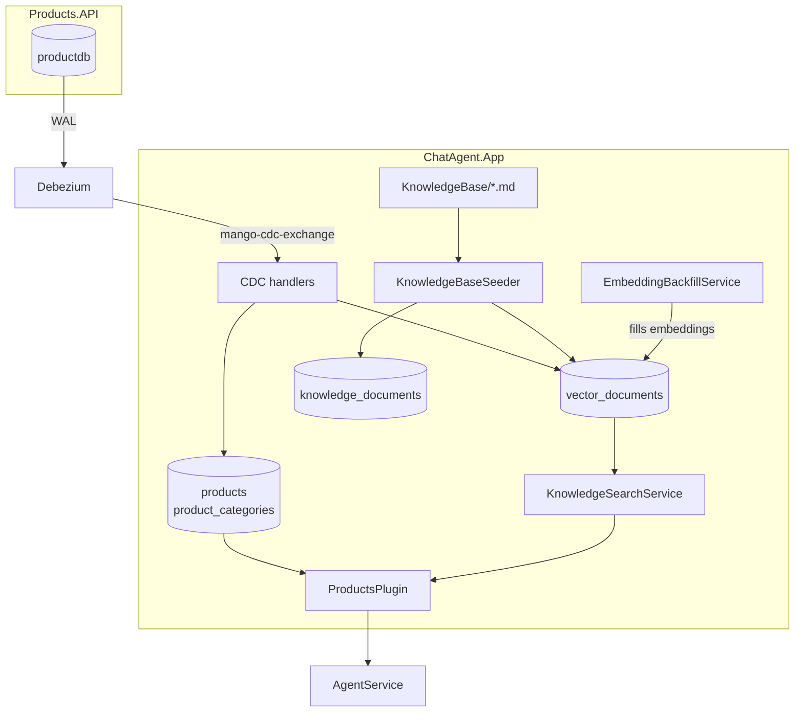
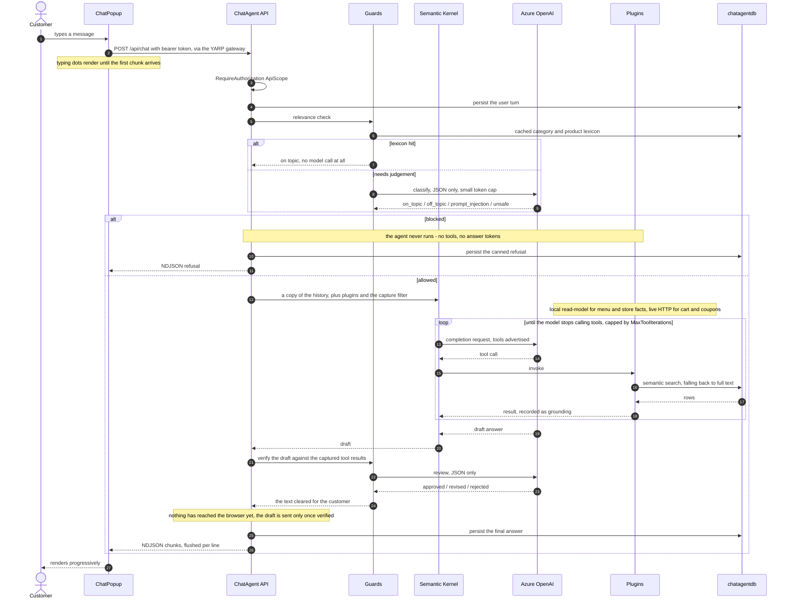

# ChatAgent: Retrieval and Guardrails

How `ChatAgent.App` answers customer questions: where its data comes from, how it is
searched, and what checks sit either side of the model.

## Why it looks like this

The agent used to call Products.API over HTTP on every menu question, through a five-minute
in-memory cache, and search it with `string.Contains`. That coupled a chat turn to another
service's availability, could not answer "something spicy and vegetarian", had no knowledge
of the store itself, and put no checks around what the model said.

It now owns a local read-model, replicated by CDC, indexed for both semantic and keyword
search, with a relevance check before the agent runs and a verification pass before the
customer sees anything.

## Data flow



That diagram is the background side — how knowledge gets *into* the service. The next one is
what happens on a single customer message.

## A chat turn, end to end



Three things the diagram is meant to make obvious:

- **The relevance check runs before anything expensive.** A blocked question costs one cheap
  classification at most, and often nothing — the lexicon tier resolves most real traffic
  without a model call.
- **The history handed to Semantic Kernel is a copy.** Automatic function calling appends
  tool-call bookkeeping to whatever history it is given, and the cached instance is a
  process-lifetime singleton.
- **Delivery happens after verification, not during generation.** That is the whole reason
  for the pause the typing indicator covers.

## Replication

Products and categories arrive over the existing Debezium stream — see [CDC.md](CDC.md).
`ProductCdcEventHandler` and `CatalogTypeCdcEventHandler` upsert the mirror row and its
index entry in one `SaveChangesAsync`, so the agent can never see a product with no
searchable text.

Handlers never call the embedding model. They mark the index entry as needing a vector and
return, which is what keeps a slow or failing Azure OpenAI call from dead-lettering a CDC
message. An upsert whose text is unchanged leaves the existing embedding alone, so CDC's
at-least-once redeliveries cost nothing.

Carts and coupons are still live HTTP calls. Those are transactional writes against another
service's state, where a local replica would be wrong.

## The index

One table, `vector_documents`, holds everything retrievable:

| Column | Purpose |
| --- | --- |
| `source_type` | `Product`, `ProductCategory`, or `KnowledgeChunk` |
| `source_id` | Key of the row it was built from |
| `content` | The text that gets embedded and indexed |
| `metadata` | `jsonb` extras (product name/price, heading breadcrumb) |
| `embedding` | `vector(1536)`, HNSW index with `vector_cosine_ops` |
| `search_vector` | Stored generated `tsvector`, GIN index |
| `embedded_at` | Null means "queued for embedding" |

One table means one HNSW index, one GIN index, and one search path, while retrieval still
targets products or store documents by filtering on `source_type`.

Requires the `vector` extension, which is why AppHost runs `pgvector/pgvector:pg18` rather
than the stock Postgres image. The migration emits `CREATE EXTENSION` itself.

Two things about that image override are easy to get wrong:

- **Keep the tag on the same major version Aspire would otherwise start.** PostgreSQL cannot
  read a data directory written by a newer major, so an older tag makes an existing volume
  fail with `initdb: error: directory "/var/lib/postgresql/data" exists but is not empty`.
- **Mount the volume at `/var/lib/postgresql`, not `/var/lib/postgresql/data`.** PostgreSQL
  18 images keep data in major-version-specific subdirectories (`PGDATA` is
  `/var/lib/postgresql/18/docker`). `WithDataVolume()` derives its target from the image
  tag, and `pg18` is not parseable as a version, so it falls back to the pre-18 path and the
  server reports *"there appears to be PostgreSQL data in: /var/lib/postgresql/data (unused
  mount/volume)"*. AppHost therefore uses an explicit
  `WithVolume("mango-postgres-data", "/var/lib/postgresql")`, which also avoids Docker
  creating a throwaway anonymous volume for the image's declared `VOLUME`.

## Search

`KnowledgeSearchService` tries three tiers and returns the first that produces hits:

1. **Semantic** — embed the query, order by cosine distance, drop anything beyond
   `MaxCosineDistance` so an unrelated question returns nothing rather than the least-bad
   match.
2. **Full text** — `websearch_to_tsquery` ranked by `ts_rank_cd`. Used whenever embeddings
   are switched off, the embedding call failed, or the semantic pass found nothing.
   `websearch_to_tsquery` is chosen over `to_tsquery` because it tolerates raw user input.
3. **Fuzzy** — `ILIKE` on the longest word in the query, so one distinctive term still
   matches when the tsquery parser rejects the phrase.

`AIAgent:Embedding:Enabled=false` (or a blank deployment name) is a supported mode, not a
failure state: nothing is embedded and everything is served from full-text search.

Product hits are hydrated from the `products` mirror rather than answered out of the indexed
text, so a price can never drift between the index and the read-model.

## Knowledge base

Markdown files in `src/Services/ChatAgent.App/KnowledgeBase/` are the store's own facts —
contact, address, hours, delivery, refunds, allergens, loyalty, privacy. The whole folder is
scanned, so more files can be added with no code change.

### Ingestion ledger

`knowledge_documents` records `source_path`, a SHA-256 of the file, `chunk_count` and
`ingested_at`. On startup, a file whose hash matches its ledger row is skipped entirely — no
re-chunking, no embedding spend. An edited file is re-ingested from scratch, and a deleted
file has its chunks removed so the agent stops citing a policy that no longer exists.

Each document is ingested in one transaction, so a crash mid-file cannot leave the ledger
claiming a document was read when only some of its chunks landed.

### Chunking

Splitting on `##` alone does not survive a real document: one long policy section blows past
the embedding model's input window, and a chunk that broad gets retrieved for everything.
`MarkdownChunker` therefore descends only as far as it must.

1. **Structure** — parse the heading tree; each leaf section is a candidate chunk carrying
   its heading breadcrumb.
2. **Descend** — a candidate over `MaxChunkChars` is re-split by the next separator in
   priority order, re-checking after each level:
   `deeper headings → blank-line paragraphs → single lines → sentences → hard character cut`.
   Descent stops as soon as the pieces fit, so well-sized sections are never over-fragmented.
3. **Merge** — adjacent runt pieces (under `MinChunkChars`) are coalesced while they stay
   under budget, so a page of one-line bullets does not become hundreds of weak chunks.
4. **Overlap** — `ChunkOverlapChars` of the previous piece is repeated at the start of the
   next, within a section only, so a fact spanning a boundary survives.
5. **Breadcrumb** — every chunk is prefixed with its heading path. This is what keeps a
   fragment like "within 5-7 business days" retrievable for "refund policy", and it is why
   the sentence and hard-cut tiers stay usable instead of producing orphans.

Fenced code blocks and contiguous table rows are treated as atomic units, so packing never
cuts through the middle of one; an oversized block is still split as a last resort, by line.
Files above `MaxDocumentBytes` are skipped with a warning, and chunks are flushed to the
database in batches of `IngestBatchSize`.

## Guardrails

### Quick guard — before the agent runs

`RelevanceGuard` decides whether a question is worth handing to the agent at all. A blocked
question never reaches a tool, so it costs nothing beyond the check.

- **Tier 0, free** — an on-topic word list plus the live category and product names from the
  replicated catalogue. Most real questions ("do you have pho?", "where are you?", "cancel
  my order") hit this and skip the model entirely. Deliberately broad: a false "on topic"
  only runs the agent as it would have anyway, whereas a false "off topic" refuses a real
  customer.
- **Tier 1, cheap** — a short JSON-only classification for everything else, returning
  `on_topic`, `off_topic`, `prompt_injection` or `unsafe`. This is also what catches
  injection and abuse, not merely off-topic questions.

Both turns are still written to `chat_messages` when a question is turned away, so the
transcript stays coherent.

### Grounding capture — during the agent run

`GroundingCaptureFilter` is a Semantic Kernel `IAutoFunctionInvocationFilter` that records
every tool result for the turn. Without it, output verification would only be a second
opinion from the same model; with it, the guard checks the draft against the facts that
actually came back.

The same filter caps tool round-trips at `MaxToolIterations`. Semantic Kernel does not bound
automatic function calling, so a confused model can otherwise loop indefinitely.

### Output guard — before the customer sees anything

`ResponseGuard` reviews the complete draft against the captured grounding and returns
**approved**, **revised**, or **rejected**. It looks for: dishes, prices, hours or policies
not supported by the retrieved facts; stock claims (there is no stock data); leaked system
instructions or tool internals; instructions that came from inside retrieved text rather
than from the customer; and off-brand or unsafe content.

This is why `AgentService` buffers. The answer is generated in full and verified before the
first chunk leaves the service — there is no retraction path once text has reached a
browser. It costs a second or two of time-to-first-token.

## Response wire format

`POST /api/chat` streams **newline-delimited JSON**: one `{"content":"..."}` object per
line, flushed as it is produced.

The endpoint writes to the response body directly rather than returning an
`IAsyncEnumerable<PromptResponseDto>`. Minimal APIs serialise that as a single JSON array
(`[{...},{...}]`) with no line breaks, which a streaming client cannot parse until the
array closes — the React widget rendered empty bubbles because it splits on newlines and
never found one.

Both front-ends read NDJSON:

- `src/UI/mango-ui/src/api/chat.ts` — `fetch` + `ReadableStream` reader, splitting on `\n`.
- `src/UI/Mango.Web/Services/ChatService.cs` — `StreamReader.ReadLineAsync`. It cannot use
  `ReadFromJsonAsAsyncEnumerable`, which expects a JSON array.

Payload names are camelCase (`JsonSerializerDefaults.Web`); changing that breaks both
clients.

### Failure behaviour

`Guard:FailOpen` (default `true`) decides what happens when a guard call itself fails: open
degrades the guard so a transient Azure blip does not take the whole chat down; closed means
an unverifiable answer is never shown. Set it to `false` where correctness outranks
availability.

## Configuration

Secrets belong in user-secrets, never `appsettings.json`:

```powershell
dotnet user-secrets --project src/Services/ChatAgent.App set "AIAgent:ApiKey" "<key>"
dotnet user-secrets --project src/Services/ChatAgent.App set "AIAgent:ApiUrl" "https://<resource>.services.ai.azure.com"
dotnet user-secrets --project src/Services/ChatAgent.App set "AIAgent:ModelId" "<chat-deployment>"
dotnet user-secrets --project src/Services/ChatAgent.App set "AIAgent:Embedding:DeploymentName" "text-embedding-3-small"
```

| Setting | Default | Notes |
| --- | --- | --- |
| `Embedding:Enabled` | `true` | `false` serves everything from full-text search |
| `Embedding:Dimensions` | `1536` | Must match the `vector(n)` column; validated at startup |
| `Embedding:MaxCosineDistance` | `0.55` | Lower is stricter |
| `Embedding:BatchSize` | `32` | Documents embedded per backfill pass |
| `Guard:InputEnabled` | `true` | The quick relevance guard |
| `Guard:OutputEnabled` | `true` | Answer verification |
| `Guard:ModelId` | *(blank)* | A cheaper deployment for guard calls; falls back to the chat model |
| `Guard:FailOpen` | `true` | Behaviour when a guard call fails |
| `Guard:MaxToolIterations` | `6` | Cap on tool round-trips per turn |
| `KnowledgeBase:MaxChunkChars` | `1200` | ~4 chars per token, well inside the embedding window |
| `KnowledgeBase:MinChunkChars` | `200` | Below this, chunks are merged |
| `KnowledgeBase:ChunkOverlapChars` | `150` | Carried between chunks within a section |

Changing the embedding model to one with different output dimensions requires a migration —
the column type and HNSW index are fixed-width. Startup refuses rather than filling the
queue with documents that can never be embedded.

## Operations

**First run after these changes** needs the Debezium offsets discarded, because Debezium
will not snapshot a newly included table (`catalog_types`) against existing offsets:

```powershell
docker volume rm debezium-data
```

The Postgres data volume is kept. `pgvector/pgvector:pg18` is the stock PostgreSQL 18 image
plus the extension, so it mounts the existing data directory unchanged and no dev data is
lost.

The volume is now named explicitly (`mango-postgres-data`) rather than generated by
`WithDataVolume()`. If you are coming from a build that used the generated name, copy the
data across once — this is additive, and the old volume stays as a backup:

```powershell
docker volume create mango-postgres-data
docker run --rm -v <old-generated-name>:/from -v mango-postgres-data:/to alpine `
  sh -c "cp -a /from/. /to/"
```

Useful queries against `chatagentdb`:

```sql
-- Extension present?
SELECT * FROM pg_extension WHERE extname = 'vector';

-- Replication caught up?
SELECT count(*) FROM products;
SELECT count(*) FROM product_categories;

-- Which documents have been ingested, and at what content?
SELECT source_path, content_hash, chunk_count, ingested_at FROM knowledge_documents;

-- Embedding queue draining?
SELECT count(*) FROM vector_documents WHERE embedded_at IS NULL;

-- Chunk size distribution for a document
SELECT min(length(content)), max(length(content)), count(*)
FROM vector_documents WHERE source_type = 3;
```

## Testing

`tests/Services/ChatAgent.App.Tests` covers the chunker (heading splits, recursive descent,
merging, overlap, code fences and tables, a multi-MB document), the CDC handlers and
Debezium decimal decoding, and both guards including their fail-open and fail-closed paths.

Retrieval itself is not unit-tested: the in-memory provider cannot execute `tsvector` or
`vector` SQL, so semantic and full-text search are verified against a real database.
