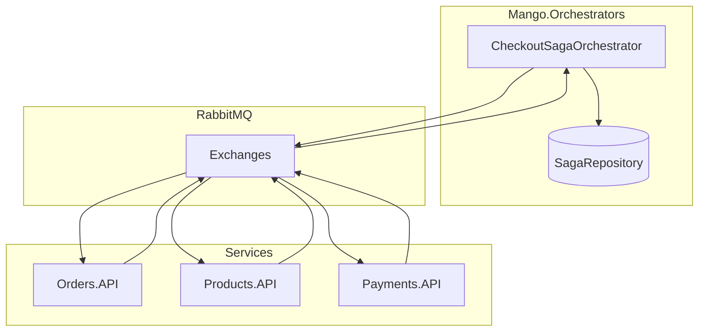
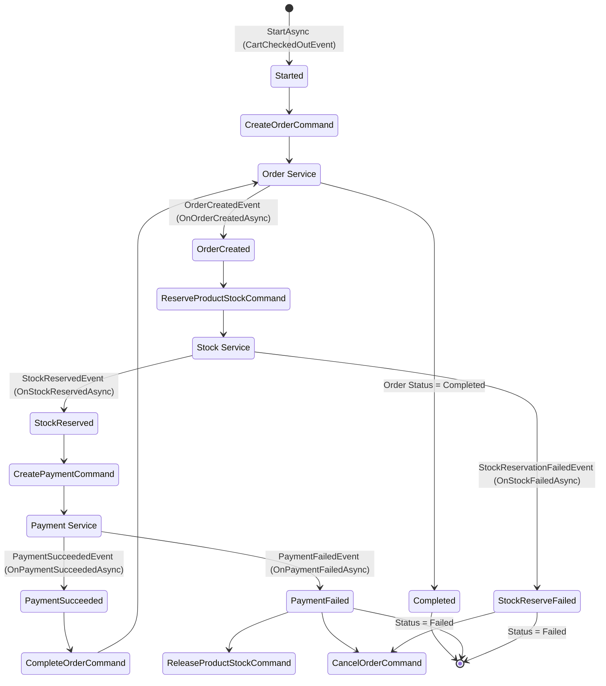

# Checkout Saga Workflow

This document describes the workflow of the Checkout Saga, orchestrated by `CheckoutSagaOrchestrator`.

## Architecture Overview

The Checkout Saga uses the **Orchestrator Pattern** to coordinate a distributed transaction across multiple microservices. The orchestrator maintains saga state and publishes commands to services, which respond with events.



## Saga State Machine



## Flow Description

1. **Start**: The Saga starts when a `CartCheckedOutEvent` is received. It publishes a `CreateOrderCommand`.
2. **Order Creation**: The Order Service creates the order and publishes `OrderCreatedEvent`.
3. **Stock Reservation**: The Saga requests stock reservation via `ReserveProductStockCommand`.
   - **Success**: `StockReservedEvent` triggers payment creation.
   - **Failure**: `StockReservationFailedEvent` triggers `CancelOrderCommand` and ends the saga as `Failed`.
4. **Payment**: The Saga requests payment via `CreatePaymentCommand`.
   - **Success**: `PaymentSucceededEvent` triggers `CompleteOrderCommand` to finalize the order, then marks the saga as `Completed`.
   - **Failure**: `PaymentFailedEvent` triggers `ReleaseProductStockCommand` and `CancelOrderCommand`, ending the saga as `Failed`.

## Events & Commands

### Commands (Published by Orchestrator)

| Command | Target Service | Exchange | Description |
|---------|---------------|----------|-------------|
| `CreateOrderCommand` | Orders.API | `orders-domain.events` | Create a new order |
| `ReserveProductStockCommand` | Products.API | `catalog.events` | Reserve stock for items |
| `CreatePaymentCommand` | Payments.API | `payments.events` | Process payment |
| `CompleteOrderCommand` | Orders.API | `orders-domain.events` | Mark order as completed |
| `CancelOrderCommand` | Orders.API | `orders-domain.events` | Cancel the order |
| `ReleaseProductStockCommand` | Products.API | `catalog.events` | Release reserved stock |

### Events (Received by Orchestrator)

| Event | Source Service | Exchange | Handled By |
|-------|---------------|----------|------------|
| `CartCheckedOutEvent` | ShoppingCart.API | `carts.events` | `CartCheckedOutEventHandler` |
| `OrderCreatedEvent` | Orders.API | `orders-domain.events` | `OrderCreatedEventHandler` |
| `StockReservedEvent` | Products.API | `catalog.events` | `StockReservedEventHandler` |
| `StockReservationFailedEvent` | Products.API | `catalog.events` | `StockReservationFailedEventHandler` |
| `PaymentSucceededEvent` | Payments.API | `payments.events` | `PaymentSucceededEventHandler` |
| `PaymentFailedEvent` | Payments.API | `payments.events` | `PaymentFailedEventHandler` |

## Key Components

### Orchestrator

- **`ICheckoutSagaOrchestrator`** - Interface defining saga operations
- **`CheckoutSagaOrchestrator`** - Implementation that coordinates the workflow
- **`ISagaRepository`** - Persists saga state to database

### Integration Handlers

Located in `Mango.Orchestrators/IntegrationHandlers/`:

| Handler | Handles Event |
|---------|---------------|
| `CartCheckedOutEventHandler` | `CartCheckedOutEvent` |
| `OrderCreatedEventHandler` | `OrderCreatedEvent` |
| `StockReservedEventHandler` | `StockReservedEvent` |
| `StockReservationFailedEventHandler` | `StockReservationFailedEvent` |
| `PaymentSucceededEventHandler` | `PaymentSucceededEvent` |
| `PaymentFailedEventHandler` | `PaymentFailedEvent` |

## Configuration

### RabbitMQ Subscriptions (Program.cs)

```csharp
builder.AddRabbitMQEventBus("eventbus")
    .AddSubscription<CartCheckedOutEvent, CartCheckedOutEventHandler>("carts.events")
    .AddSubscription<OrderCreatedEvent, OrderCreatedEventHandler>("orders-domain.events")
    .AddSubscription<StockReservedEvent, StockReservedEventHandler>("catalog.events")
    .AddSubscription<StockReservationFailedEvent, StockReservationFailedEventHandler>("catalog.events")
    .AddSubscription<PaymentSucceededEvent, PaymentSucceededEventHandler>("payments.events")
    .AddSubscription<PaymentFailedEvent, PaymentFailedEventHandler>("payments.events");
```

## Error Handling & Compensation

The saga implements compensating transactions for failures:

| Failure Point | Compensation Actions |
|--------------|---------------------|
| Stock Reservation Failed | Cancel Order |
| Payment Failed | Release Stock + Cancel Order |

## Saga State Persistence

Saga state is persisted to PostgreSQL via `SagaDbContext`:

```csharp
public class SagaState
{
    public Guid Id { get; set; }           // Correlation ID
    public Guid? OrderId { get; set; }
    public Guid? PaymentId { get; set; }
    public OrderStatus StatusId { get; set; }
    public string CartItemsJson { get; set; }
}
```
