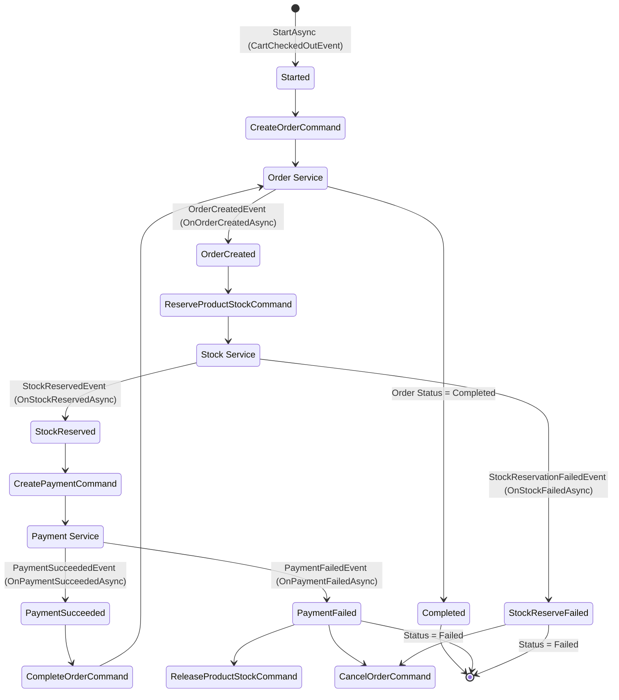

# Checkout Saga Workflow

This document describes the workflow of the Checkout Saga, orchestrated by `CheckoutSagaOrchestrator`.

## Saga State Machine

## Flow Description

1.  **Start**: The Saga starts when a `CartCheckedOutEvent` is received. It publishes a `CreateOrderCommand`.
2.  **Order Creation**: The Order Service creates the order and publishes `OrderCreatedEvent`.
3.  **Stock Reservation**: The Saga requests stock reservation via `ReserveProductStockCommand`.
    -   **Success**: `StockReservedEvent` triggers payment creation.
    -   **Failure**: `StockReservationFailedEvent` triggers `CancelOrderCommand` and ends the saga as `Failed`.
4.  **Payment**: The Saga requests payment via `CreatePaymentCommand`.
    -   **Success**: `PaymentSucceededEvent` triggers `CompleteOrderCommand` to finalize the order, then marks the saga as `Completed`.
    -   **Failure**: `PaymentFailedEvent` triggers `ReleaseProductStockCommand` and `CancelOrderCommand`, ending the saga as `Failed`.
