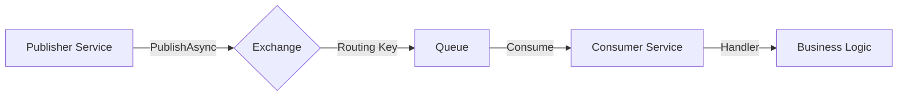

# Event Bus Documentation

This project implements an Event Bus pattern to enable asynchronous communication between microservices. It supports **RabbitMQ** (for local development) and **Azure Service Bus** (for production), abstracted behind the `IEventBus` interface.

## How It Works

The Event Bus decouples senders (Publishers) from receivers (Subscribers) using a Publish/Subscribe model.

### Architecture



### 1. Publishing Flow
1.  **Serialization**: When `PublishAsync<T>(event)` is called, the event object is serialized to JSON.
2.  **Routing**: The event's class name (e.g., `OrderCreatedEvent`) is used as the **Routing Key**.
3.  **Delivery**: The message is sent to a RabbitMQ **Exchange** (named in `appsettings.json`, e.g., `orders-events`).
4.  **Resilience**: If the connection is lost, a persistent channel and `ResiliencePipeline` ensure retries.

### 2. Subscribing Flow
1.  **Registration**: In `Program.cs`, `AddSubscription<TEvent, THandler>` registers the handler in the DI container and maps the event type to the routing key.
2.  **Binding (Startup)**: When the service starts (`IHostedService.StartAsync`):
    -   It creates a **Queue** (specific to the service, e.g., `orders-queue`).
    -   It **binds** the Queue to the Exchange using the Routing Keys of all registered subscriptions.
3.  **Consuming**: A background listener waits for messages on the Queue.
4.  **Processing**:
    -   When a message arrives, it is deserialized back to the C# Event object.
    -   A DI scope is created.
    -   All registered handlers for that event are resolved and executed **in parallel**.
    -   **Ack**: The message is Acknowledged (removed from queue) *only* if processing succeeds.

---

## Configuration

### 1. AppHost (`Mango.AppHost`)

Define the RabbitMQ resource with explicit credentials to ensure connectivity across containers.

```csharp
// AppHost.cs
var rabbitUser = builder.AddParameter("rabbit-user", "user");
var rabbitPassword = builder.AddParameter("rabbit-password", "password");

var rabbitMq = builder.AddRabbitMQ("eventbus", userName: rabbitUser, password: rabbitPassword)
    .WithManagementPlugin()
    .WithLifetime(ContainerLifetime.Persistent);

builder.AddProject<Projects.Orders_API>("orders-api")
    .WithReference(rabbitMq); 
```

### 2. Service (`Program.cs`)

Register the Event Bus and subscriptions. Note the API difference:

**RabbitMQ:**
```csharp
builder.AddRabbitMQEventBus("eventbus")
    .AddSubscription<OrderCreatedEvent, OrderCreatedHandler>("orders.events"); // Exchange Name
```

**Azure Service Bus:**
```csharp
builder.AddServiceBusEventBus("mango")
    .AddSubscription<OrderCreatedEvent, OrderCreatedHandler>("orders-topic", "orders-sub"); // Topic + Subscription Name
```

### 3. Settings (`appsettings.json`)

Configure the connection settings.

**RabbitMQ:**
```json
"EventBus": {
  "DomainName": "orders-events",
  "SubscriptionClientName": "orders-queue", // Queue Name
  "RetryCount": 5
}
```

---

## Switching Implementations

To switch from RabbitMQ to Azure Service Bus (or vice versa), you need to update two places:

### Step 1: Update AppHost (`AppHost.cs`)

Comment out the old resource and add the new one.

```csharp
// 1. Comment out RabbitMQ
// var rabbitMq = builder.AddRabbitMQ("eventbus")...;

// 2. Uncomment/Add Azure Service Bus
var serviceBus = builder.AddAzureServiceBus("mango")
    .RunAsEmulator(); // Remove for production

// 3. Update Project References
builder.AddProject<Projects.Orders_API>("orders-api")
    // .WithReference(rabbitMq)
    .WithReference(serviceBus);
```

### Step 2: Update Services (`Program.cs`)

Change the registration method in each microservice.

```csharp
// 1. Comment out RabbitMQ registration
// builder.AddRabbitMQEventBus("eventbus")
//     .AddSubscription<T, H>("exchange-name");

// 2. Add Service Bus registration
builder.AddServiceBusEventBus("mango")
    .AddSubscription<T, H>("topic-name", "subscription-name");
```

> **Note**: Azure Service Bus requires both a **Topic Name** (where events go) and a **Subscription Name** (specific to this app), whereas RabbitMQ just needs the **Exchange Name** (the queue is derived or configured separately).


---

## Usage Guide

### Defining Events
Events must be `record` types inheriting from `IntegrationEvent`.

```csharp
public record OrderCreatedEvent(Guid OrderId, string UserId) : IntegrationEvent;
```

### Publishing
Inject `IEventBus` and call `PublishAsync`.

```csharp
public class OrderService(IEventBus eventBus)
{
    public async Task CreateOrder(Order order)
    {
        // ... business logic ...
        await eventBus.PublishAsync(new OrderCreatedEvent(order.Id, order.UserId));
    }
}
```

### Handling
Implement `IIntegrationEventHandler<T>`.

```csharp
public class OrderCreatedHandler : IIntegrationEventHandler<OrderCreatedEvent>
{
    public async Task HandleAsync(OrderCreatedEvent @event)
    {
        Console.WriteLine($"Processing order: {@event.OrderId}");
        // ... business logic ...
    }
}
```
