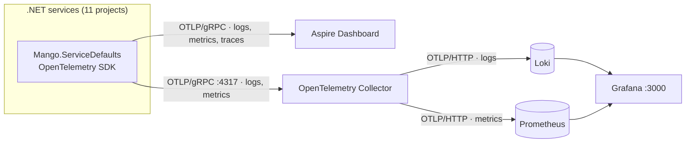

# Observability: Grafana, Prometheus and Loki

MangoAspire ships two telemetry backends side by side. The **Aspire dashboard** stays the
default and receives everything, including traces. A **Grafana + Prometheus + Loki** stack
runs alongside it and receives logs and metrics, giving queryable, persistent storage that
survives a restart of the AppHost.

Both receive the same OpenTelemetry data. Nothing is instrumented twice, and no service
knows which backend stores what.

## Architecture



The collector is the only thing the services talk to. Swapping Loki for another log store
is a change to `otel-collector.yaml`, not to any C# code.

### Why a collector rather than pushing straight to the backends

Loki and Prometheus both accept OTLP directly, so the collector is not strictly required.
It earns its place by giving one endpoint per service instead of one per signal, and by
being the place where batching, memory limiting, sampling and attribute rewriting belong
when they are needed later.

## Components

| Resource | Image | Endpoint | Purpose |
| :--- | :--- | :--- | :--- |
| `otel-collector` | `otel/opentelemetry-collector-contrib:0.158.0` | `4317` gRPC, `4318` HTTP, `13133` health | Receives OTLP, fans out |
| `loki` | `grafana/loki:3.7.6` | `3100` | Log storage and LogQL queries |
| `prometheus` | `prom/prometheus:v3.13.2` | `9090` | Metric storage and PromQL queries |
| `grafana` | `grafana/grafana:13.1.3` | `3000` | Dashboards over both stores |

All four use `ContainerLifetime.Persistent` and named volumes, matching how `postgres`,
`eventbus` and `debezium` are already declared, so history survives between runs.

## How to run

The stack starts with everything else — no extra step:

```bash
dotnet run --project src/Mango.AppHost/Mango.AppHost.csproj
```

Then open **<http://localhost:3000>**. Grafana runs with anonymous admin access, so there
is no login step and no credential stored in this repository. The provisioned dashboard is
**Mango → Mango - Services Overview**.

### The `UseGrafanaStack` flag

The switch is declared in `src/Mango.AppHost/appsettings.json`, alongside `IdentityType`:

```json
{
  "IdentityType": "OpenIddict",
  "UseGrafanaStack": true
}
```

Flip it to `false` to skip the stack — useful for a lighter run, or when the ports are
already taken. It can be overridden per run without editing the file, in precedence order:

```bash
# command line
dotnet run --project src/Mango.AppHost/Mango.AppHost.csproj -- --UseGrafanaStack false

# environment variable
UseGrafanaStack=false dotnet run --project src/Mango.AppHost/Mango.AppHost.csproj
```

When it is off, no container starts and the services export to the Aspire dashboard only.
A value that is neither `true` nor `false` fails fast with an `InvalidOperationException`
rather than silently picking a default, matching how `IdentityType` is validated.

### Ports

`3000` Grafana · `3100` Loki · `9090` Prometheus · `4317`/`4318` collector OTLP ·
`13133` collector health. None of these collide with the existing `5435` (Postgres),
`15672` (RabbitMQ), `8083` (Debezium) or `5173` (SPA).

## How the services are wired

`Mango.ServiceDefaults` reads two environment variables and registers one OTLP exporter per
destination:

| Variable | Set by | Meaning |
| :--- | :--- | :--- |
| `OTEL_EXPORTER_OTLP_ENDPOINT` | Aspire, automatically | Aspire dashboard |
| `OBSERVABILITY_OTLP_ENDPOINT` | `ObservabilityExtensions.WithGrafanaTelemetry` | The collector |

> [!IMPORTANT]
> `UseOtlpExporter()` claims exporter registration exclusively — calling it *and* a
> signal-specific `AddOtlpExporter()` throws `NotSupportedException`. Exporting to two
> backends therefore means registering every exporter explicitly. `AddOpenTelemetryExporters`
> keeps the original `UseOtlpExporter()` call for the single-backend case and only switches
> to explicit registration when the collector endpoint is present.

The collector exporter is a *named* option (`grafana-stack`). Named options still bind the
`OTEL_EXPORTER_OTLP_*` variables first, so the endpoint, protocol and headers are all
overwritten rather than inherited — in particular `Headers` is cleared, because the
dashboard's API key is a secret meant for a different backend.

### Adding a new service

Add it to the `instrumentedProjects` array at the bottom of `AppHost.cs`. Nothing else is
needed; `AddServiceDefaults()` already does the SDK side.

## What is collected

**Logs** — every `ILogger<T>` call, including the `LoggingBehavior<,>` MediatR entries, with
formatted messages and scopes enabled.

**Metrics** — ASP.NET Core, `HttpClient` and .NET runtime instrumentation, which land in
Prometheus as `http_server_request_duration_seconds_*`, `http_client_request_duration_seconds_*`,
`kestrel_*` and `dotnet_*` (GC, JIT, thread pool, `dotnet_process_memory_working_set_bytes`).

**Traces** — collected, but sent to the **Aspire dashboard only**. See
[Adding traces](#adding-traces-tempo) below.

### Label mapping

Resource attributes become labels, which is what makes the two stores joinable by service:

| OpenTelemetry attribute | Loki label | Prometheus label |
| :--- | :--- | :--- |
| `service.name` | `service_name` | `service_name` (and `job`) |
| `service.namespace` | `service_namespace` | `service_namespace` |
| `deployment.environment.name` | `deployment_environment_name` | promoted when present |

Metric names are translated with `UnderscoreEscapingWithSuffixes`, so
`http.server.request.duration` is stored as `http_server_request_duration_seconds`.

Log attributes that are not promoted to labels are kept as Loki *structured metadata*
(`allow_structured_metadata: true`), so nothing is silently dropped. Loki also derives a
`detected_level` field from each record's OTLP severity.

## Querying

Logs for one service, errors only:

```logql
{service_name="products-api"} | detected_level =~ "error|critical|fatal"
```

Request rate per service:

```promql
sum by (service_name) (rate(http_server_request_duration_seconds_count[$__rate_interval]))
```

95th percentile latency:

```promql
histogram_quantile(0.95, sum by (le, service_name) (rate(http_server_request_duration_seconds_bucket[$__rate_interval])))
```

> [!WARNING]
> Loki rejects matchers that can match an empty value: `service_name=~".*"` fails with
> *"queries require at least one regexp or equality matcher that does not have an
> empty-compatible value"*. Use `.+`. This is why the dashboard's `service` variable sets
> `allValue` to `.+` and not the Grafana default of `.*`.

## Files

```text
src/Mango.AppHost/
├── ObservabilityExtensions.cs              # Declares the four containers, wires services
├── AppHost.cs                              # Calls AddGrafanaObservability() + WithGrafanaTelemetry()
└── init-configs/observability/
    ├── otel-collector.yaml                 # Receivers, processors, fan-out exporters
    ├── prometheus.yml                      # OTLP receiver, label promotion, retention
    ├── loki.yaml                           # Single-binary, filesystem storage, 7-day retention
    └── grafana/
        ├── provisioning/datasources/       # Prometheus + Loki, pre-wired
        ├── provisioning/dashboards/        # Points Grafana at /etc/grafana/dashboards
        └── dashboards/mango-services.json  # HTTP rate/errors/latency + log volume/errors/stream

src/Shared/Mango.ServiceDefaults/Extensions.cs   # Dual OTLP exporter registration
```

Dashboards are mounted at `/etc/grafana/dashboards`, deliberately outside
`/var/lib/grafana`, because that path is a Docker volume and nesting the two is fragile.

## Extending

### Adding traces (Tempo)

Traces are the one signal the Grafana stack does not receive, because there is no trace
store in it. Adding Tempo takes three edits:

1. A container in `ObservabilityExtensions.AddGrafanaObservability`:

   ```csharp
   var tempo = builder.AddContainer("tempo", "grafana/tempo", "2.9.1")
       .WithArgs("-config.file=/etc/tempo/tempo.yaml")
       .WithBindMount($"{ConfigDirectory}/tempo.yaml", "/etc/tempo/tempo.yaml", isReadOnly: true)
       .WithVolume("mango-tempo-data", "/var/tempo")
       .WithHttpEndpoint(port: 3200, targetPort: 3200, name: "http")
       .WithLifetime(ContainerLifetime.Persistent);
   ```

2. A traces pipeline in `otel-collector.yaml`, exporting `otlp/tempo` to `tempo:4317`.

3. A `.WithTracing(tracing => tracing.AddOtlpExporter(CollectorExporterName, ...))` call
   alongside the existing logs and metrics registrations in `AddOpenTelemetryExporters`.

Add a Tempo datasource and Loki's `derivedFields` can then turn a `trace_id` in a log line
into a link to the trace.

### Adding a dashboard

Drop a JSON file into `init-configs/observability/grafana/dashboards/`. The provisioner
rescans every 30 seconds. `allowUiUpdates` is on, so edits made in the Grafana UI survive
until the next restart, but the files on disk remain the source of truth — export and
commit anything worth keeping.

### Adding custom metrics

Register a `Meter` and add it in `ConfigureOpenTelemetry`:

```csharp
metrics.AddMeter("Mango.Orders");
```

There are currently no custom meters in the solution; `RabbitMQTelemetry` and
`ServiceBusTelemetry` contribute `ActivitySource` traces only.

## Troubleshooting

**Grafana is empty.** Traffic has to flow first — the services emit nothing until requested.
Exercise the SPA or an API, then check Prometheus targets at <http://localhost:9090> and run
`{service_name=~".+"}` in Grafana's Explore view.

**Metrics missing but logs present.** Prometheus rejects samples older than its
out-of-order window. `loki.yaml` and `prometheus.yml` set 30 minutes; a service that was
paused in the debugger for longer will have gaps.

**Port already allocated.** Something else holds `3000`, `3100`, `9090` or `4317`. Either
stop it or run with `--UseGrafanaStack false`.

**A config change appears to be ignored.** The containers are persistent. Remove the
container (`docker rm -f loki`) so Aspire recreates it against the edited bind mount.

**Verifying the pipeline without the app.** Post OTLP JSON straight at the collector:

```bash
curl -X POST http://localhost:4318/v1/logs -H "Content-Type: application/json" -d @payload.json
```

A `200` with `{"partialSuccess":{}}` means the collector accepted it; query Loki afterwards
to confirm it was stored.
