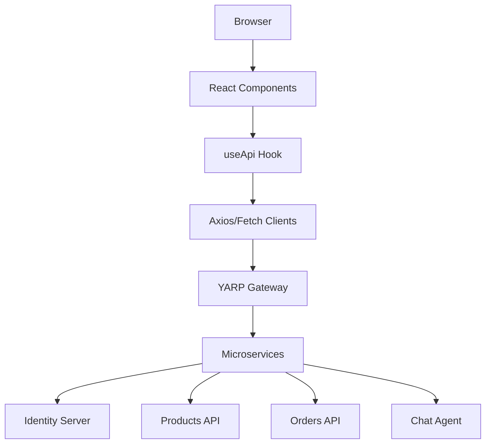

# Mango SPA Architecture

This document describes the high-level architecture of the Mango SPA React application.

## Overview

The Mango SPA is a modern React application built with TypeScript and Vite. It serves as the frontend for the MangoAspire microservices ecosystem, communicating with various backend services through a YARP Gateway.

## Key Architectural Patterns

### 1. API Integration (`/src/api` & `/src/hooks`)
- **Factory Pattern**: API services are defined as factory functions (e.g., `productsApi`, `cartApi`) that accept an Axios instance.
- **`useApiClient`**: A custom hook that creates an Axios instance with base URL configuration and interceptors to automatically inject JWT Bearer tokens from the identity store.
- **`useApi` Aggregator**: A simplified hook that provides access to all API services in a unified object, memoized for performance.
- **Streaming API**: For the AI Chatbot, the `sendMessage` function uses the native `fetch` API directly to handle `ReadableStream` responses, allowing for real-time text streaming.

### 2. State Management (`/src/context`)
- **Context API + Hooks**: The application uses React Context for global state management to avoid prop drilling and complex external libraries like Redux.
    - `AuthContext`: Manages user identity, token storage, and login/logout flows using `oidc-client-ts`.
    - `CartContext`: Manages the shopping cart state, count, and persistent synchronization with the backend ShoppingCart.API.
    - `ThemeContext`: Manages UI themes (Dark/Light) and persists user preference.

### 3. Navigation & Routing (`/src/App.tsx`)
- **React Router**: Client-side routing for navigating between the Catalog, Product Details, Cart, Checkout, and Order History.
- **Protected Routes**: A `ProtectedRoute` wrapper ensures that sensitive pages (like Profile, Checkout, and Orders) are only accessible to authenticated users, redirecting others to the login flow.

### 4. Styling & Theme System (`src/index.css`)
- **CSS Variables**: A centralized design system using CSS variables for colors, spacing, and shadows.
- **Mode-switching**: Theme-specific color palettes are swapped at the root `:root` or `body` level based on the current theme state.
- **Component Styling**: Each major component (e.g., `ChatPopup`, `ProductCard`) has a dedicated `.css` file using localized classes and global tokens.

### 5. AI Shopping Assistant (`src/components/ChatPopup.tsx`)
- **Floating UI**: A self-contained widget accessible from any page.
- **History Loading**: Intelligently fetches and displays conversation history using normalized timestamps.
- **Message Parsing**: Custom logic to parse streamed JSON chunks from the backend `IAsyncEnumerable` endpoint.

## Data Flow Diagram

